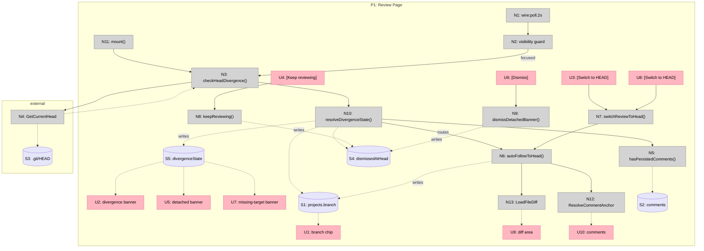

# Reactive Branch Selector

## Problem

RFA's header shows the last-reviewed branch (`projects.branch`), not the currently checked-out branch. When the user switches branches externally (GitHub Desktop, CLI, IDE), RFA keeps showing the stale branch with "No changes detected", indistinguishable from "repo is clean" or "app is desynced". The app lies with certainty.

## Outcome

When the user opens RFA (or is already in it) after switching branches externally, they understand at a glance: what's checked out now, what RFA is showing them, and how to reconcile the two if they differ, without losing an in-progress review.

---

## Requirements (R)

| ID | Requirement | Status |
|----|-------------|--------|
| R0 | Header reflects reality; never show a stale branch as if it were current | Core goal |
| R1 | External branch switches (GitHub Desktop, CLI, IDE) are detected while RFA is open | Must-have |
| R2 | In-progress reviews (with comments) are not silently discarded when HEAD changes | Must-have |
| R3 | Divergence between checked-out HEAD and review target is visible, not hidden | Must-have |
| R4 | Reconciling divergence is one click (switch review target, or keep current) | Must-have |
| R5 | Passive/casual use (no active review) "just works"; opens on current branch, no ceremony | Must-have |
| R6 | User intent is never destroyed; an explicitly opened review stays opened until dismissed | Must-have |
| R7 | No settings rabbit hole; behavior is visible and reversible per-repo, not buried | Nice-to-have |

---

## Shapes (audit trail)

### A: Always follow HEAD (pure reactive)

| Part | Mechanism |
|------|-----------|
| A1 | Drop persisted `projects.branch`; always resolve live via `git rev-parse HEAD` on mount |
| A2 | File-watcher on `.git/HEAD` refreshes UI on external switch |
| A3 | Reviews/comments keyed to branch name; re-appear when user returns to that branch |

### B: Persist review target, banner on divergence

| Part | Mechanism |
|------|-----------|
| B1 | Keep `projects.branch` as "review target"; add live HEAD lookup |
| B2 | File-watcher on `.git/HEAD` emits divergence event |
| B3 | Banner: "Repo switched to `main`. You're still reviewing `feature/a`." with [Switch review to main] [Keep reviewing feature/a] |
| B4 | Header shows review target; subtle "on main" indicator when divergent |

### C: Reactive by default, sticky when review has comments (selected)

See "Selected Shape" below.

### D: Dual-label header always (graph-centric)

| Part | Mechanism |
|------|-----------|
| D1 | Header shows two chips: `Checked out: main` and `Reviewing: feature/a` |
| D2 | When equal, collapse into single chip |
| D3 | Clicking either chip lets user switch that side independently |
| D4 | File-watcher on `.git/HEAD` updates "Checked out" chip live |

---

## Fit Check

| Req | Requirement | Status | A | B | C | D |
|-----|-------------|--------|---|---|---|---|
| R0 | Header reflects reality | Core goal | ✅ | ✅ | ✅ | ✅ |
| R1 | External switches detected while RFA is open | Must-have | ✅ | ✅ | ✅ | ✅ |
| R2 | In-progress reviews not silently discarded | Must-have | ❌ | ✅ | ✅ | ✅ |
| R3 | Divergence visible, not hidden | Must-have | ✅ | ✅ | ✅ | ✅ |
| R4 | One-click reconciliation | Must-have | ✅ | ✅ | ✅ | ✅ |
| R5 | Passive use "just works" | Must-have | ✅ | ❌ | ✅ | ❌ |
| R6 | Intent never destroyed | Must-have | ❌ | ✅ | ✅ | ✅ |
| R7 | No settings rabbit hole | Nice-to-have | ✅ | ✅ | ✅ | ❌ |

**Notes:**
- A fails R2, R6: silently discards in-progress reviews on external switch.
- B fails R5: banner fires on every open-after-switch, even when the user has no investment in the old target (noisy for the passive case).
- C uses comment-presence as the signal for "this review matters"; banner only fires when there's something to protect.
- D costs constant header real estate and dual mental model even when not needed.

---

## Selected Shape: C

### Parts (V1)

| Part | Mechanism |
|------|-----------|
| C1 | On mount and on poll tick: read live HEAD via `git symbolic-ref --short HEAD` (detect detached); compare to `projects.branch` |
| C2 | If `projects.branch` has zero persisted comments and HEAD differs, auto-follow: set `projects.branch = HEAD`, reload diff silently. No session save needed; comments re-anchor by content hash via `ResolveCommentAnchorAction` |
| C3 | If `projects.branch` has ≥1 comment and HEAD differs, show banner: "Repo switched to `main`. You're still reviewing `feature/a`." with [Switch review to main] [Keep reviewing feature/a] |
| C4 | `wire:poll.2s` on review page, guarded by Alpine visibility (polls only while window is focused); triggers C1 |
| C5 | "Switch review to main" → `projects.branch = HEAD`, dismiss banner, reload diff. Old review stays persisted, reachable via dropdown |
| C6 | "Keep reviewing target" → dismiss banner for session. Re-appears on next external HEAD change, on RFA restart if still diverged, or on repo switch away and back. Dismissal state is ephemeral (Livewire component state, not persisted) |
| C7 | Detached HEAD is not a valid review target in V1. If HEAD is detached, show info banner: "Repo is detached at `abc123f`. Still reviewing `feature/a`." Single action: [Dismiss]. No auto-follow, no switch. (`GetBranchListAction` and the dropdown explicitly reject detached HEADs; teaching them is V2.) |
| C8 | Missing target branch: `projects.branch` no longer exists locally. Banner reads "Review target `feature/a` no longer exists." Single action: [Switch to HEAD] (no "keep" in V1) |

### Behavior matrix

| HEAD vs target | Comments on target | What happens |
|---|---|---|
| Equal | any | Normal, no banner |
| Diverged | 0 | Silent auto-follow; target updated to HEAD |
| Diverged | ≥1 | Banner with Switch / Keep |
| HEAD detached | any | Info banner (C7), dismiss-only. Target stays put. |
| Target branch gone | any | Banner (C8) with single Switch action |

### Final fit check

| Req | Requirement | C |
|-----|-------------|---|
| R0 | Header reflects reality | ✅ |
| R1 | External switches detected while RFA is open | ✅ |
| R2 | In-progress reviews not silently discarded | ✅ |
| R3 | Divergence visible, not hidden | ✅ |
| R4 | One-click reconciliation | ✅ |
| R5 | Passive use "just works" | ✅ |
| R6 | Intent never destroyed | ✅ |
| R7 | No settings rabbit hole | ✅ |

---

## Decisions log

- Signal for "stickiness" is `has comments` (simple, effective enough for V1).
- No explicit pin toggle in V1 (comments-as-pin covers the 95%).
- File-watcher scope is the active repo only; re-bound on repo switch.
- Poll strategy is `wire:poll.2s` + Alpine visibility guard (live when window focused, silent otherwise).
- Missing-target branch in V1 only offers "Switch to HEAD" (no read-only keep mode).
- Auto-follow (C2) does not trigger a session save; comments re-anchor naturally by content hash via `ResolveCommentAnchorAction`. Session Save/Restore remains orthogonal.
- Detached HEAD is not a valid review target in V1. Show info banner, dismiss-only. Proper support is V2 (requires teaching `GetBranchListAction`, `GitMetadataService::getBranches`, and `branch-explorer.js` about non-branch targets).
- Polling uses a new lightweight `GetCurrentHeadAction` (runs `git symbolic-ref --short HEAD` and detects detached state); not `GetBranchListAction`.

---

## Unresolved questions

(none; ready to breadboard)

---

## Detail C: Breadboard

### Places

| # | Place | Description |
|---|-------|-------------|
| P1 | Review Page | Existing diff review interface. Contains header (branch chip), conditional banner region, file list, diff area, comments |

### Stores

| # | Place | Store | Description |
|---|-------|-------|-------------|
| S1 | P1 | `projects.branch` | Persisted review target (DB column) |
| S2 | P1 | `comments` | Persisted review comments (DB table) |
| S3 | external | `.git/HEAD` | Current git HEAD of active repo (filesystem; read via git CLI) |
| S4 | P1 | `$dismissedAtHead` | Ephemeral: HEAD value at time user dismissed banner (Livewire prop) |
| S5 | P1 | `$divergenceState` | Ephemeral: `Aligned` / `Diverged` / `Detached` / `MissingTarget` (Livewire prop) |
| S6 | P1 | `$divergenceContext` | Ephemeral: `{targetBranch, currentBranch, currentSha, detached}` (Livewire prop) |

### UI Affordances

| # | Place | Component | Affordance | Control | Wires Out | Returns To |
|---|-------|-----------|------------|---------|-----------|------------|
| U1 | P1 | review-page header | branch chip (shows `projectBranch`) | render | — | — |
| U2 | P1 | review-page | divergence banner: "Repo switched to `X`. You're reviewing `Y`." | render (if S5=Diverged) | — | — |
| U3 | P1 | U2 | [Switch review to HEAD] | click | → N7 | — |
| U4 | P1 | U2 | [Keep reviewing target] | click | → N8 | — |
| U5 | P1 | review-page | detached-HEAD info banner: "Repo is detached at `abc123f`. Still reviewing `Y`." | render (if S5=Detached) | — | — |
| U6 | P1 | U5 | [Dismiss] | click | → N9 | — |
| U7 | P1 | review-page | missing-target banner: "Review target `Y` no longer exists." | render (if S5=MissingTarget) | — | — |
| U8 | P1 | U7 | [Switch to HEAD] | click | → N7 | — |
| U9 | P1 | review-page | file list / diff area (existing) | render | — | — |
| U10 | P1 | review-page | comments display (existing) | render | — | — |

### Code Affordances

| # | Place | Component | Affordance | Control | Wires Out | Returns To |
|---|-------|-----------|------------|---------|-----------|------------|
| N1 | P1 | review-page | `wire:poll.2s="checkHeadDivergence"` | poll (2s) | → N2 | — |
| N2 | P1 | review-page (Alpine) | visibility guard (`document.hasFocus()`, `visibilitychange`) | observe | → N3 (gated to focused) | — |
| N3 | P1 | review-page (Livewire) | `checkHeadDivergence()` | call | → N4, → N10 | — |
| N4 | external | `GetCurrentHeadAction` | `__invoke(repoPath)` — runs `git symbolic-ref --short HEAD`; on failure reads SHA via `git rev-parse HEAD` and marks detached | call | reads S3 | → N3 |
| N5 | P1 | review-page | `hasPersistedComments(projectId)` | call | reads S2 | → N10 |
| N6 | P1 | review-page | `autoFollowToHead(newBranch)` | call | writes S1, → N12, → N13 | — |
| N7 | P1 | review-page (Livewire) | `switchReviewToHead()` | call | → N6 | — |
| N8 | P1 | review-page (Livewire) | `keepReviewing()` — records current HEAD so banner suppresses until HEAD moves | call | writes S4, writes S5 (→ Aligned) | — |
| N9 | P1 | review-page (Livewire) | `dismissDetachedBanner()` | call | writes S4, writes S5 | — |
| N10 | P1 | review-page | `resolveDivergenceState(head)` — routes based on current state | call | → N5, reads S1, reads S4; then either → N6 or writes S5/S6 | → N3 |
| N11 | P1 | review-page | `mount()` (existing, extended) | call | → N3 | — |
| N12 | P1 | `ResolveCommentAnchorAction` | `__invoke()` (existing) | call | reads S2 | → U10 |
| N13 | P1 | `LoadFileDiffAction` | `__invoke()` (existing) | call | — | → U9 |

### Wiring (logic flow)

- On mount / poll tick (focused):
  - N11 or N1+N2 → N3
    - N3 → N4 `GetCurrentHeadAction` → `{branch|null, sha, detached}`
    - N3 → N10 `resolveDivergenceState`
      - Target branch missing from repo → write S5=MissingTarget, S6
      - HEAD detached AND not suppressed by S4 → write S5=Detached, S6
      - HEAD == target → write S5=Aligned (no-op)
      - HEAD ≠ target AND N5=false (no comments) → → N6 auto-follow (silent)
      - HEAD ≠ target AND N5=true AND not suppressed → write S5=Diverged, S6
- User actions:
  - U3 click → N7 → N6 → writes S1, → N13 reload, → N12 re-anchor
  - U4 click → N8 → writes S4=currentHead, S5=Aligned
  - U6 click → N9 → writes S4=currentHead, S5=Aligned
  - U8 click → N7 → N6

### Mermaid

### Part → Affordance map

| Part | Affordances |
|------|-------------|
| C1 (mount + poll compare) | N1, N11, N3, N4, N10 |
| C2 (auto-follow, no comments) | N5, N6, N12, N13 |
| C3 (divergence banner) | U2, U3, U4 |
| C4 (poll + visibility) | N1, N2 |
| C5 (Switch action) | N7 |
| C6 (Keep action) | U4, N8, S4 |
| C7 (detached info) | U5, U6, N9 |
| C8 (missing target) | U7, U8 (wires to N7) |

---

## Next step

Slice into V1-V9 demo-able increments, or jump into implementation of V1 directly (the breadboard is small enough that one or two slices likely cover it).
